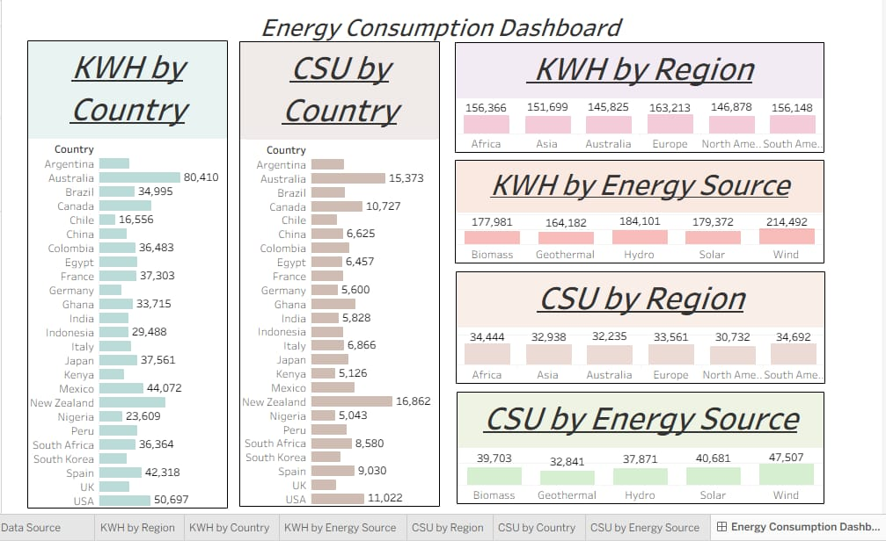

# ☁️ Cloud Data Analytics Pipeline

> End-to-end cloud data pipeline built on AWS, Snowflake, and Tableau — from raw ingestion to executive-ready dashboards.

---

## Overview

This project demonstrates a production-style analytics pipeline that ingests, transforms, and visualizes 10,000+ records using industry-standard cloud tools. Built to mirror real-world BI workflows — schema design, query optimization, and stakeholder-aligned dashboards.

---

## Tech Stack

| Layer | Tool |
|---|---|
| Cloud Infrastructure | AWS (S3, IAM, optional Glue/Lambda) |
| Data Warehouse | Snowflake |
| Visualization | Tableau |
| Query Language | SQL |

---

## Key Highlights

- **10,000+ records processed** through a fully automated cloud pipeline
- **30% query performance improvement** via Snowflake schema optimization and SQL tuning
- **5+ interactive Tableau dashboards** translating business KPIs into actionable insights
- **Stakeholder-aligned architecture** — documented design decisions mapped to business goals

---

## Architecture

```
Raw Data Source
     ↓
  AWS S3 (Storage)
     ↓
Snowflake (Schema Design + SQL Optimization)
     ↓
  Tableau (Dashboard Layer)
     ↓
Business Insights
```

---

## Dashboard Preview



> Multi-view Tableau dashboard showing KWH and CSU metrics broken down by Country, Region, and Energy Source (Biomass, Geothermal, Hydro, Solar, Wind) across 6 global regions.

---

## Dashboards

The dashboard suite covers 6 key views across two primary metrics:

- **KWH by Country** — Energy consumption per nation with bar chart breakdown
- **KWH by Region** — Aggregated consumption across Africa, Asia, Australia, Europe, North America, South America
- **KWH by Energy Source** — Comparative view across Biomass, Geothermal, Hydro, Solar, Wind
- **CSU by Country** — Carbon/cost unit analysis at country level
- **CSU by Region** — Regional CSU distribution
- **CSU by Energy Source** — Source-wise CSU breakdown

---

## What I Learned

- Designing star/snowflake schemas for analytical workloads
- Writing optimized SQL for large-scale Snowflake queries
- Translating raw data into decision-ready visual narratives
- Collaborating with stakeholders to align technical output with business goals

---

## Author

**Priyanka V** — Data Analyst | CSE @ Cambridge Institute of Technology, Bengaluru  
[LinkedIn](https://linkedin.com/in/your-link) • [Portfolio](https://your-portfolio.com)
